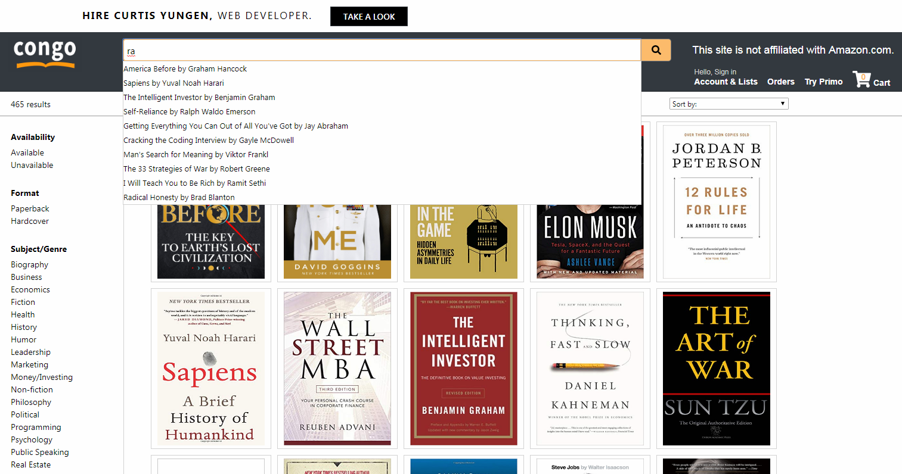
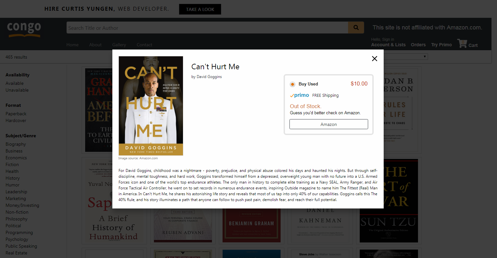
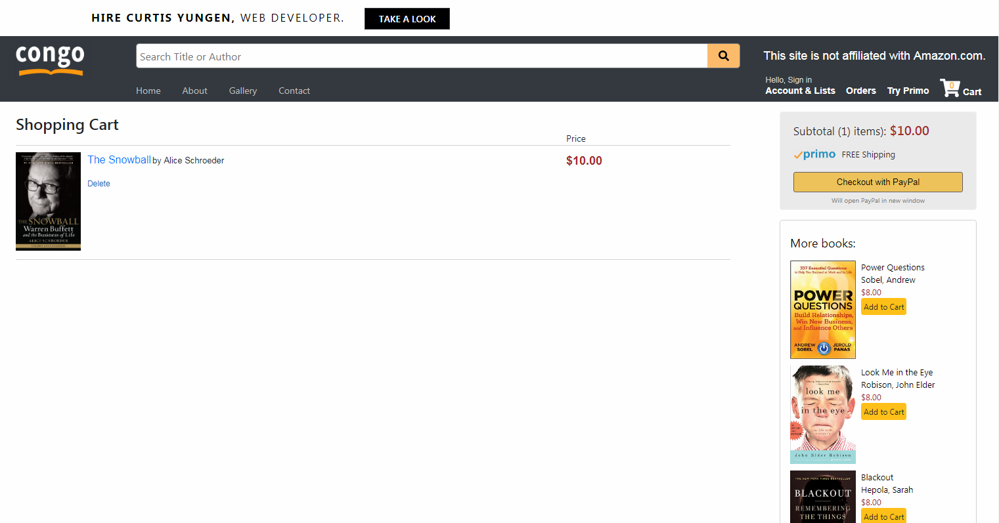
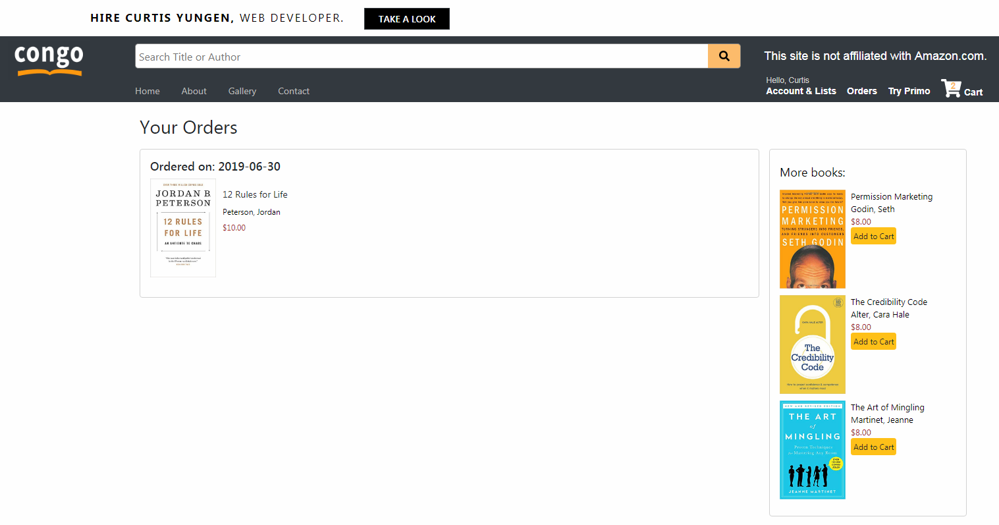
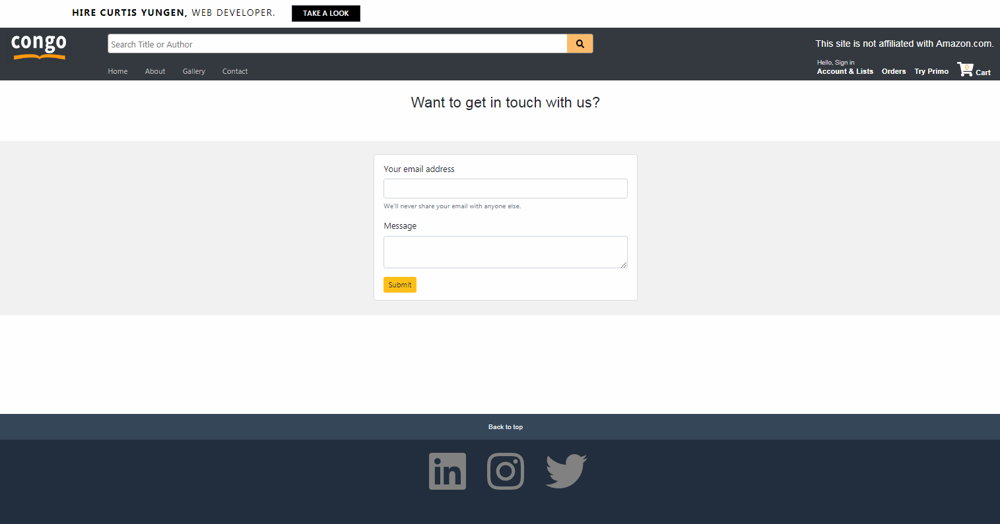
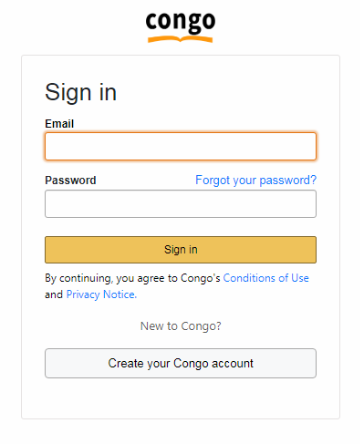
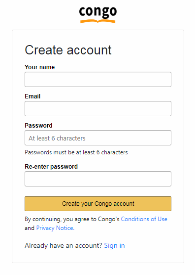
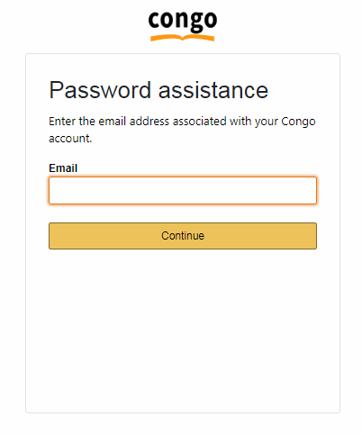
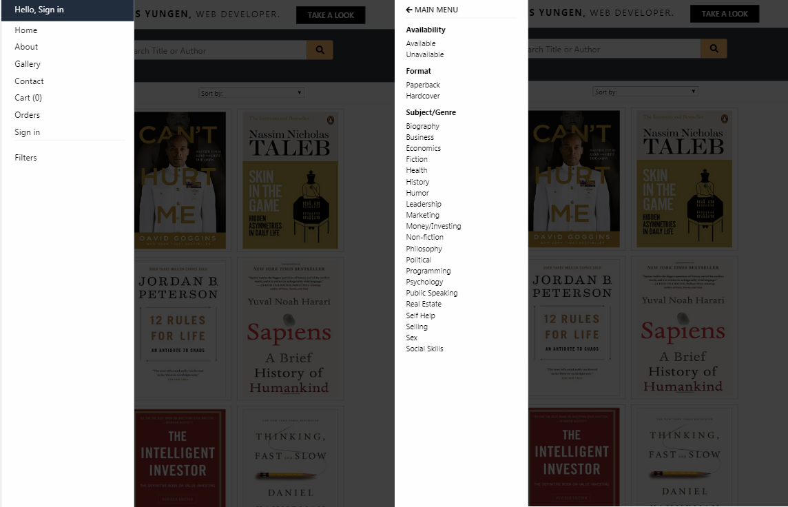

# Congo
**by Curtis Yungen**

Congo is a website I created to sell my extensive collection of self-help books. Check it out by visiting https://congobooksales.com.

### The Project

Over the years I've collected upwards of 460 books, most of them self-help books. I've read many but not all of them. A good number have been partially read, and others haven't even been opened. Now the books serve only to impress visitors to my apartment as they sit piled on the floor collecting dust.

These books have helped me; now they can help you, and at a great discount!

Visit https://congobooksales.com/about for more information on this project. 

### The Technology

Payments are handled by PayPal rather than directly by Congo. User data is private and all passwords are encrypted.

### Technologies
1) Node.js
2) Express.js
3) ReactJS
4) MySQL
5) PayPal API
6) Google Books API

### Dependencies
1) axios
2) bcrypt
3) express
4) nodemailer
5) paypal-rest-sdk
6) react-dom
7) react-responsive-modal
8) react-router
9) reactjs-popup
10) sequelize

### Download Instructions

*Ensure that you have installed a Code Editor such as Visual Studio Code as well as Node.js.
Installation instructions for Node.js can be found here: https://nodejs.org/en/download/*

1) Visit https://github.com/curtisyungen/congo
2) Click on the green button labeled Clone or download
3) Select Download ZIP
4) Open the ZIP file and extract its contents to the desired location on your computer
5) Open Visual Studio Code or the editor of your choice
6) Open a new terminal in your code editor
7) Install all dependencies by running the command "npm install"
8) Start the program by typing the command "npm start" in your terminal
9) The program will open locally in your browser

### Screenshots

Home page. This page shows all books as well as filter options for exploring the inventory.  
   

Search box: provides clickable search suggestions based on user's text input.  
   

Book Detail View: clicking a book on the home page will open a modal showing the book's details such as cover image, title, author, availability, and price, as well as an option to add the book to the user's cart if it is in stock. The book's description is ascertained by calling the Google Books API.  
   

Cart: available for both logged in users and guests, the cart stores books the user is looking to purchase. It contains a sidebar that displays other book suggestions as well as a summary of items currently in the cart. User must be logged in to make a purchase. Clicking Checkout with PayPal will open PayPal in a new window. Once purchase is complete, user is redirected to a page notifying them of the successful transaction and order summary. An email is dispatched to both the user and the Congo server with an order summary.
   

Orders: available only for logged in users. Summarizes past orders in reverse chronological order. Also displays a sidebar with book suggestions.  
   

Contact: this page provides a way for users to contact me directly.  
   

  
Login page: allows existing users to sign in to their account. Redirects to Sign up page if email doesn't exist in database.  
   

  
Sign up page: allows new users to sign up for an account. Redirects to Login Page if email already exists in database. All passwords are encrypted in database.  
   

  
Forgot Password page: provides a way to recover user's account if password is forgotten. Sends 6-digit code to email provided. Once code is verified, allows user to reset their password. All passwords are encrypted in database.  
   

Slide-in Menu: shown in certain mobile responsive views when the normal side bar is hidden. Left: navigation options. Right: filter options.
