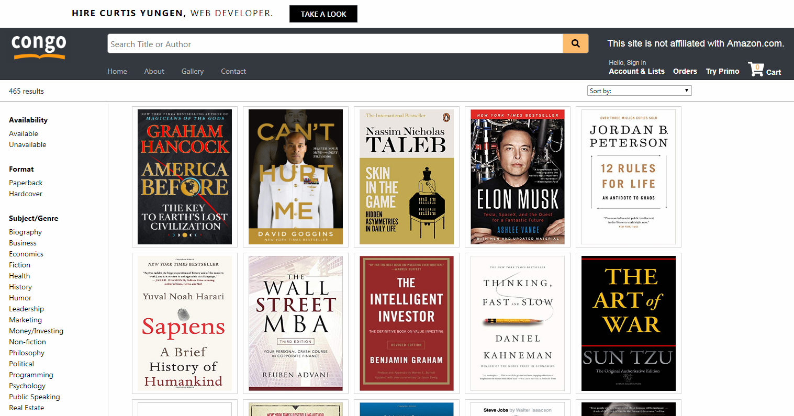

# Congo
**by Curtis Yungen**

Congo is a website I created to sell my extensive collection of self-help books. Check it out by visiting https://congobooksales.com.

**The Project**

Over the years I've collected upwards of 460 books, most of them self-help books. I've read many but not all of them. A good number have been partially read, and others haven't even been opened. Now the books serve only to impress visitors to my apartment as they sit piled on the floor collecting dust.

These books have helped me; now they can help you, and at a great discount!

Visit https://congobooksales.com/about for more information on this project. 

**The Technology**

Payments are handled by PayPal rather than directly by Congo. User data is private and all passwords are encrypted.

**Technologies**
1) Node.js
2) Express.js
3) ReactJS
4) MySQL
5) PayPal API
6) Google Books API

**Dependencies**
1) axios
2) bcrypt
3) express
4) nodemailer
5) paypal-rest-sdk
6) react-dom
7) react-responsive-modal
8) react-router
9) reactjs-popup
10) sequelize

**Download Instructions**

*Ensure that you have installed a Code Editor such as Visual Studio Code as well as Node.js.
Installation instructions for Node.js can be found here: https://nodejs.org/en/download/*

1) Visit https://github.com/curtisyungen/congo
2) Click on the green button labeled Clone or download
3) Select Download ZIP
4) Open the ZIP file and extract its contents to the desired location on your computer
5) Open Visual Studio Code or the editor of your choice
6) Open a new terminal in your code editor
7) Install all dependencies by running the command "npm install"
8) Start the program by typing the command "npm start" in your terminal
9) The program will open locally in your browser

**Screenshots**

1) Home Page

